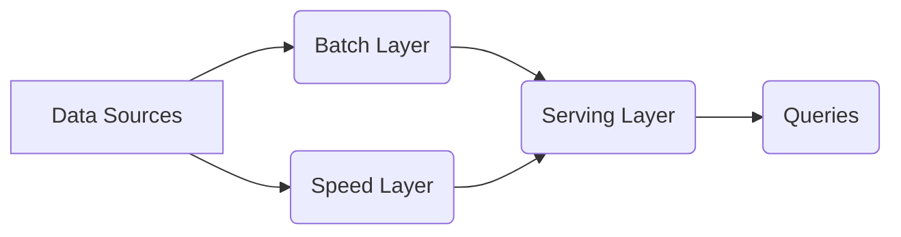
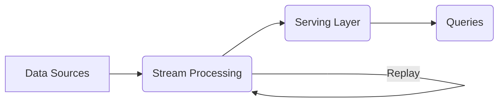

**Lesson 2: Data Pipelines and Workflow Orchestration: Design, Implement, and Optimize Scalable and Reliable Data Pipelines**

**Duration:** 90 minutes

**Authors:** Claudio Canales

-----

## Table of Contents

- [Learning Objectives](#learning-objectives)
- [I. Introduction (5 minutes)](#i-introduction-5-minutes)
    - [A. Importance of Data Pipelines](#a-importance-of-data-pipelines)
    - [B. Role of Workflow Orchestration](#b-role-of-workflow-orchestration)
- [II. Data Pipeline Fundamentals (15 minutes)](#ii-data-pipeline-fundamentals-15-minutes)
    - [A. Definition and Components of a Data Pipeline](#a-definition-and-components-of-a-data-pipeline)
    - [B. Types of Data Pipelines](#b-types-of-data-pipelines)
        - [1. Batch Processing](#1-batch-processing)
        - [2. Streaming (Real-time) Processing](#2-streaming-real-time-processing)
        - [3. Lambda Architecture](#3-lambda-architecture)
        - [4. Kappa Architecture](#4-kappa-architecture)
    - [C. Key Design Considerations](#c-key-design-considerations)
        - [Data Pipeline Design Discussion Exercise for ShopSmart](#data-pipeline-design-discussion-exercise-for-shopsmart)
            - [1. Pipeline Architecture Challenge](#1-pipeline-architecture-challenge)
            - [2. Scalability and Performance Scenario](#2-scalability-and-performance-scenario)
            - [3. AI and Machine Learning Integration](#3-ai-and-machine-learning-integration)
            - [4. Security and Compliance Considerations](#4-security-and-compliance-considerations)
- [III. Workflow Orchestration (20 minutes)](#iii-workflow-orchestration-20-minutes)
    - [A. Introduction to Workflow Orchestration](#a-introduction-to-workflow-orchestration)
    - [B. Benefits of Workflow Orchestration](#b-benefits-of-workflow-orchestration)
    - [C. Popular Workflow Orchestration Tools](#c-popular-workflow-orchestration-tools)
    - [D. Orchestrating a Data Pipeline with Apache Airflow (Example)](#d-orchestrating-a-data-pipeline-with-apache-airflow-example)
        - [1. Core Concepts in Airflow](#1-core-concepts-in-airflow)
        - [2. Illustrative Example: Orchestrating an ETL Pipeline with Airflow](#2-illustrative-example-orchestrating-an-etl-pipeline-with-airflow)
- [IV. Implementing Data Pipelines (25 minutes)](#iv-implementing-data-pipelines-25-minutes)
    - [A. Choosing the Right Tools](#a-choosing-the-right-tools)
    - [B. Building a Batch Data Pipeline](#b-building-a-batch-data-pipeline)
    - [C. Building a Streaming Data Pipeline](#c-building-a-streaming-data-pipeline)
    - [D. Testing Data Pipelines](#d-testing-data-pipelines)
- [V. Optimizing Data Pipelines (15 minutes)](#v-optimizing-data-pipelines-15-minutes)
    - [A. Performance Bottlenecks](#a-performance-bottlenecks)
    - [B. Optimization Techniques](#b-optimization-techniques)
    - [C. Monitoring and Alerting](#c-monitoring-and-alerting)
    - [Activity: Discussing Workflow Orchestration in Practice](#activity-discussing-workflow-orchestration-in-practice)
        - [Scenario:](#scenario)
        - [Discussion Prompts:](#discussion-prompts)
            - [1. Workflow Design:](#1-workflow-design)
            - [2. Tool Selection:](#2-tool-selection)
            - [3. Error Handling:](#3-error-handling)
            - [4. Monitoring and Reporting:](#4-monitoring-and-reporting)
- [VI. Conclusion and Best Practices (5 minutes)](#vi-conclusion-and-best-practices-5-minutes)
    - [A. Recap of Key Points](#a-recap-of-key-points)
    - [B. Best Practices for Building and Managing Data Pipelines](#b-best-practices-for-building-and-managing-data-pipelines)
    - [C. Future Trends in Data Pipelines and Workflow Orchestration](#c-future-trends-in-data-pipelines-and-workflow-orchestration)


-----

## Learning Objectives

By the end of this course, you will be able to:

  - **Analyze** the fundamental concepts of data pipelines and workflow orchestration.
  - **Design** data pipelines that are scalable, reliable, and maintainable.
  - **Implement** data pipelines using industry-standard tools and technologies.
  - **Orchestrate** complex workflows with tools like Apache Airflow, Prefect and others.
  - **Optimize** data pipelines for performance and efficiency.
  - **Monitor** and troubleshoot data pipelines effectively.
  - **Apply** best practices for building and managing data pipelines.

-----

## I. Introduction (5 minutes)

In the world of data engineering and AI, **data pipelines** are the highways that transport raw data from various sources to its destination, transforming it into valuable insights along the way. **Workflow orchestration** is the traffic control system that ensures smooth, efficient, and reliable data flow. In this session we will explore these crucial components of any data-driven system.

### A. Importance of Data Pipelines

Data pipelines are essential for:

  - 🔗 **Data Integration:** Bringing together data from disparate sources into a unified view.
  - 🛠️ **Data Transformation:** Cleaning, enriching, and preparing data for analysis and machine learning.
  - 📤 **Data Delivery:** Making data available to downstream applications, such as dashboards, reports, and AI models.
  - 🤖 **Automation:** Automating data processing tasks to reduce manual effort and improve efficiency.
  - 📈 **Scalability:** Handling increasing volumes of data without sacrificing performance.
  - 🛡️ **Reliability:** Ensuring that data is processed accurately and consistently, even in the face of failures.

**In essence, robust data pipelines are the backbone of any successful data-driven organization, especially those leveraging AI.** They bridge the gap between raw data and actionable insights.

**Running Example: ShopSmart**

Let's revisit our e-commerce company, ShopSmart. They need to build data pipelines to:

  - Integrate data from their website, mobile app, and physical stores.
  - Transform raw clickstream data into meaningful customer behavior insights.
  - Deliver data to their recommendation engine, fraud detection system, and marketing dashboards.
  - Automate these processes to run reliably and efficiently.

### B. Role of Workflow Orchestration

Workflow orchestration tools manage and automate the execution of tasks within a data pipeline. They provide:

  - **Dependency Management:** Defining the order in which tasks should be executed based on their dependencies.
  - **Scheduling:** Automating the execution of tasks at specific times or intervals.
  - **Monitoring:** Tracking the progress and status of tasks and workflows.
  - **Error Handling:** Defining how to handle failures and retries.
  - **Logging:** Recording events and activities for debugging and auditing.
  - **Alerting:** Notifying users of failures or other important events.

**Workflow orchestration is like a conductor for an orchestra, ensuring each instrument (task) plays at the right time and in harmony with others.**

**Bridge:** Remember how we discussed data quality and data governance in the last session? Those principles are crucial for building reliable data pipelines. For instance, without proper data validation within our pipelines, we risk feeding bad data to our AI models, leading to inaccurate results.

**Transition:** Now, let's dive into the fundamentals of data pipelines before we explore how to orchestrate them.

-----

## II. Data Pipeline Fundamentals (15 minutes)

### A. Definition and Components of a Data Pipeline

A **data pipeline** is a sequence of interconnected processing steps that transform raw data into a refined and usable format. It's a set of automated processes that extract data from various sources, transform it, and load it into a destination system.

**Key Components:**

Here's a Mermaid diagram illustrating the key components of a data pipeline:


1.  🌐 **Data Sources:** The origin of the raw data. Examples include:

      - 💾 Databases (relational, NoSQL)
      - 🌐 APIs (REST, GraphQL)
      - 🚀 Streaming platforms (Kafka, Kinesis)
      - 📄 Files (CSV, JSON, Parquet, **Images, Video, Audio**)
      - ☁️ Cloud storage (S3, Azure Blob Storage)
      - 🔌 IoT devices

2.  🚪 **Ingestion Layer:** Responsible for extracting data from the sources and bringing it into the pipeline.

      - ⏰ **Batch Ingestion:** Data is extracted in batches at scheduled intervals.
      - ⚡ **Streaming Ingestion:** Data is ingested in real-time as it is generated.

3.  🧼 **Processing/Transformation Layer:** Where data is cleaned, validated, transformed, and enriched.

      - 🧹 **Data Cleaning:** Handling missing values, correcting errors, removing duplicates.
      - ✅ **Data Validation:** Ensuring data conforms to predefined rules and constraints.
      - 🔄 **Data Transformation:** Converting data into a different format, aggregating data, joining datasets.
      - 🚀 **Feature Engineering:** Creating new features from existing data for machine learning models.

4.  📦 **Storage Layer:** Where data is stored at various stages of the pipeline.

      - 🌊 **Data Lakes:** For storing raw and semi-processed data.
      - 🏦 **Data Warehouses:** For storing structured data optimized for analytical queries.
      - 💽 **Databases:** For storing processed data ready for consumption.
      - 💨 **Caches:** For storing frequently accessed data to improve performance.

5.  🎯 **Serving Layer:** Also called the **Consumption Layer**. Makes the processed data available to downstream applications and users.

      - 🔌 **APIs:** For programmatic access to data.
      - 📊 **Dashboards and Reports:** For visualizing data and insights.
      - 🤖 **Machine Learning Models:** For training and inference.

**Example:** For ShopSmart, a data pipeline might involve:

  - **Data Sources:** Website clickstream data, purchase transactions from their database, product images stored on AWS S3, and social media feeds.
  - **Ingestion:** Using Kafka to ingest real-time clickstream events and a batch process to extract daily sales data and images from S3.
  - **Processing:** Using Spark to clean, transform, and join the clickstream, sales data and product information extracted from image metadata, calculating features like session duration and purchase frequency.
  - **Storage:** Storing raw data in a data lake (e.g., AWS S3) and processed data in a data warehouse (e.g., Snowflake).
  - **Serving:** Making data available to a recommendation engine via an API and to marketing analysts via dashboards.

### B. Types of Data Pipelines

Data pipelines can be categorized based on how they process data:

#### 1. Batch Processing

  - Data is processed in batches at scheduled intervals (e.g., hourly, daily).
  - Suitable for large datasets where real-time processing is not required.
  - **Example:** Processing daily sales transactions overnight to generate reports. Processing all the images uploaded to an e-commerce platform to extract product information.
  - **Tools:** Spark, Hadoop, traditional ETL tools.

#### 2. Streaming (Real-time) Processing

  - Data is processed in real-time as it is generated.
  - Suitable for applications that require immediate insights, such as fraud detection or real-time monitoring.
  - **Example:** Processing sensor data from IoT devices to detect anomalies or processing live video feeds for security surveillance.
  - **Tools:** Kafka, Flink, Spark Streaming, Storm.

#### 3. Lambda Architecture

  - Combines batch and streaming processing to provide both historical and real-time views of the data.
  - **Batch Layer:** Processes historical data in batches (e.g., using Hadoop or Spark). Provides a comprehensive and accurate view of the data but with higher latency.
  - **Speed Layer:** Processes real-time data streams (e.g., using Kafka and Spark Streaming or Flink). Provides low-latency insights but might be less accurate due to the nature of real-time processing.
  - **Serving Layer:** Merges the results from the batch and speed layers to provide a unified view. Queries can be directed to either layer or both, depending on the need for accuracy and latency.
  - **Complexity:** Can be complex to implement and maintain due to the need for two separate pipelines.

<!-- end list -->



**Example:** ShopSmart might use a Lambda architecture to analyze both historical sales data and real-time website traffic.

  - **Batch Layer:** Processes daily sales data to generate reports on product performance, customer segmentation, and sales trends. This layer uses Spark to process large volumes of data stored in a data lake (e.g., AWS S3) and loads the results into a data warehouse (e.g., Snowflake).
  - **Speed Layer:** Processes real-time clickstream data using Kafka and Spark Streaming to monitor website traffic, detect anomalies (e.g., sudden spikes in traffic, potential fraud), and provide real-time recommendations to users.
  - **Serving Layer:** Combines the results from the batch and speed layers. For example, a dashboard might show daily sales trends from the batch layer alongside real-time website traffic metrics from the speed layer.

#### 4. Kappa Architecture

  - A simplified version of the Lambda architecture that uses a single stream processing pipeline to handle both real-time and historical data.
  - Relies on a streaming platform that can handle the replay of historical data (e.g., Kafka).
  - **Historical data is treated as a special case of real-time data.** When historical data needs to be processed, it is replayed through the streaming pipeline.
  - **Eliminates the need for a separate batch layer**, simplifying the architecture and reducing maintenance overhead.
  - **Requires a streaming platform that can handle replay of historical data.**

<!-- end list -->



**Example:** ShopSmart could use a Kappa architecture to process both historical and real-time data with a single pipeline.

  - **Stream Processing:** Uses Kafka and Flink to process real-time clickstream data, providing insights into user behavior, product popularity, and potential fraud.
  - **Historical Data Replay:** When a new feature is added or a model needs to be retrained, historical clickstream data is replayed through Kafka as if it were real-time data. Flink processes this historical data just like it processes real-time data.
  - **Serving Layer:** Stores the processed data in a database (e.g., Cassandra) that can handle both real-time and historical queries.

**Example:** Imagine ShopSmart wants to analyze customer behavior patterns to improve its recommendation engine.

  - With a **Lambda architecture**, they would have a batch layer processing historical data to identify long-term trends and a speed layer processing real-time data for immediate recommendations.
  - With a **Kappa architecture**, they would use a single streaming pipeline. When they need to analyze historical data, they would replay it through the streaming platform as if it were new data, allowing them to apply the same processing logic to both historical and real-time data.

### C. Key Design Considerations

When designing data pipelines, consider the following factors:

1.  🚀 **Scalability:**

      - 🌐 **Horizontal Scaling:** Adding more machines to handle increasing data volumes.
      - ⬆️ **Vertical Scaling:** Increasing the resources (CPU, memory) of existing machines.
      - 🤖 **Auto-scaling:** Automatically adjusting resources based on demand.

2.  🛡️ **Reliability:**

      - 💪 **Fault Tolerance:** Designing the pipeline to handle failures gracefully.
      - ✅ **Data Validation:** Ensuring data quality throughout the pipeline.
      - 🚨 **Monitoring and Alerting:** Tracking the health of the pipeline and receiving notifications of failures.

3.  🧩 **Maintainability:**

      - 🧱 **Modularity:** Breaking down the pipeline into smaller, independent components.
      - 📚 **Code Reusability:** Using libraries and frameworks to avoid writing repetitive code.
      - 📝 **Documentation:** Clearly documenting the pipeline's architecture, code, and dependencies.
      - 🔀 **Version Control:** Using version control systems like Git to track changes.

4.  🔒 **Security:**

      - 🚪 **Access Control:** Restricting access to data and pipeline components.
      - 🔐 **Encryption:** Protecting data at rest and in transit.
      - 🕶️ **Data Masking/Anonymization:** Protecting sensitive data.

5.  ⚡ **Performance:**

      - ⏱️ **Latency:** Minimizing the time it takes to process data.
      - 📊 **Throughput:** Maximizing the amount of data that can be processed per unit of time.
      - 🚀 **Optimization Techniques:** Using appropriate data structures, algorithms, and hardware.

6.  💰 **Cost:**

      - 📈 **Resource Utilization:** Optimizing resource usage to minimize costs.
      - ☁️ **Cloud Costs:** Considering the costs of cloud services (storage, compute, network).
      - 🛒 **Choosing the right tools** that offer good price-performance ratio.

**Example:** ShopSmart needs to design its pipelines to handle increasing data volumes as the company grows (scalability), ensure that data is processed accurately even if some components fail (reliability), and be easy to update and maintain as their business needs change (maintainability). They must also consider data security, performance, and cost.

# Data Pipeline Design Discussion Exercise for ShopSmart 🛍️🚀

### 1. Pipeline Architecture Challenge 🏗️

ShopSmart wants to integrate data from multiple sources:

  - Website clickstream data
  - Mobile app interactions
  - In-store point-of-sale systems
  - Social media engagement
  - Customer support interactions
  - Product images from vendors

**Discuss:**

  - Which type of data pipeline architecture would you recommend?
  - What are the pros and cons of your proposed approach?
  - How would you handle the different data formats and ingestion speeds?
  - How would you incorporate image data into the pipeline, and what kind of insights could you derive from it?

### 2. Scalability and Performance Scenario 📈

The company is experiencing 300% year-over-year growth, with data volume increasing exponentially.

**Challenge:**

  - How would you design the data pipeline to handle this growth?
  - What scaling strategies would you implement?
  - How would you balance performance, cost, and reliability?

### 3. AI and Machine Learning Integration 🤖

**Explore:**

-   What data pipeline design would support machine learning model training and inference, particularly for image-based recommendations?
-   How would you ensure data quality and feature engineering, especially when dealing with image data?
-   What monitoring and validation techniques would you recommend for machine learning pipelines?

### 4. Security and Compliance Considerations 🔒

ShopSmart operates globally and must comply with various data protection regulations.

**Discuss:**

-   What security measures would you implement in the data pipeline, particularly when handling potentially sensitive image data?
-   How would you handle data privacy and anonymization?
-   What are the potential risks and mitigation strategies?

**Transition:** Now that we understand the fundamentals of data pipelines, let's explore how workflow orchestration helps manage them effectively.

-----

## III. Workflow Orchestration (20 minutes)

Workflow orchestration tools are essential for managing the complexity of data pipelines, especially as they grow in size and sophistication.

### A. Introduction to Workflow Orchestration

**Workflow orchestration** is the automation of a sequence of tasks or actions, often involving multiple systems or applications, to achieve a specific business or technical goal. In the context of data pipelines, workflow orchestration tools manage the execution, scheduling, monitoring, and error handling of the various tasks that make up the pipeline.

**Key Concepts:**

-   🔄 **Workflow:** A collection of interconnected tasks that are executed in a specific order to achieve a desired outcome. It defines the flow of data and the dependencies between tasks.
-   🛠️ **Task:** A single unit of work within a workflow, such as extracting data, transforming data, or loading data into a database.
-   🌳 **Directed Acyclic Graph (DAG):** A common way to represent workflows, where tasks are nodes and dependencies are directed edges. The "acyclic" part means there are no circular dependencies.
-   ⏰ **Scheduler:** Responsible for triggering the execution of workflows and tasks at the defined times or intervals.
-   🚀 **Executor:** Responsible for running the tasks, either locally or on a distributed cluster.
-   📋 **Metadata Store:** A database that stores information about workflows, tasks, and their execution history.

Here's a Mermaid diagram illustrating a simple workflow as a DAG:


### B. Benefits of Workflow Orchestration

-   **Automation:** Automates the execution of complex data pipelines, reducing manual effort and the risk of human error.
-   **Dependency Management:** Ensures that tasks are executed in the correct order based on their dependencies.
-   **Scheduling:** Allows tasks to be scheduled to run at specific times or intervals, or triggered by events.
-   **Monitoring and Logging:** Provides visibility into the status of workflows and tasks, making it easier to identify and troubleshoot issues.
-   **Error Handling and Retries:** Allows for the definition of error handling and retry policies to make pipelines more robust.
-   **Scalability:** Many orchestration tools can scale to handle large and complex workflows.
-   **Reproducibility:** Ensures that workflows can be re-run consistently, producing the same results.
-   **Collaboration:** Provides a centralized platform for managing and monitoring data pipelines, facilitating collaboration among team members.

**Example:** For ShopSmart, workflow orchestration ensures that their data pipelines run automatically on a schedule, that tasks are executed in the correct order, and that any errors are logged and reported. This allows their data engineering team to focus on building new features and improving the pipeline instead of manually running and monitoring tasks.

### C. Popular Workflow Orchestration Tools

Several powerful workflow orchestration tools are available, each with its strengths and weaknesses:

1.  **Apache Airflow:**
    -   **Open-source platform** for authoring, scheduling, and monitoring workflows.
    -   **Workflows defined as DAGs in Python code.**
    -   **Large and active community.**
    -   **Extensive integration with other tools and services.**
    -   **Scalable and reliable.**
    -   **Web UI for monitoring and managing workflows.**

2.  **Prefect:**
    -   **Modern, Python-based workflow orchestration tool.**
    -   **Focus on dynamic, DAG-like workflows (but allows for more flexibility).**
    -   **Strong emphasis on testing and developer experience.**
    -   **Hybrid execution model (cloud and local).**
    -   **Intuitive UI and API.**

3.  **Luigi:**
    -   **Open-source Python package** developed by Spotify.
    -   **Workflows defined as Python classes.**
    -   **Good for batch pipelines.**
    -   **Built-in visualization and monitoring.**
    -   **Less active community compared to Airflow.**

4.  **Dagster:**
    -   **Data orchestrator that emphasizes testing, data quality, and local development.**
    -   **Strong typing and data dependencies.**
    -   **Powerful UI for development and operations.**
    -   **Growing community.**

5.  **AWS Step Functions:**
    -   **Serverless orchestration service** from Amazon Web Services.
    -   **Workflows defined as state machines using JSON.**
    -   **Integrates well with other AWS services.**
    -   **Good for event-driven architectures.**

6.  **Azure Data Factory:**
    -   **Cloud-based data integration service** from Microsoft.
    -   **Visual interface for creating and managing pipelines.**
    -   **Integrates well with other Azure services.**
    -   **Can be used for ETL and workflow orchestration.**

7.  **Google Cloud Composer:**
    -   **Fully managed workflow orchestration service** built on Apache Airflow.
    -   **Leverages Google Cloud infrastructure.**
    -   **Easy to set up and manage.**

**Choosing the right tool depends on factors like:**

-   **Project requirements**
-   **Team expertise**
-   **Existing infrastructure**
-   **Scalability needs**
-   **Budget**

### D. Orchestrating a Data Pipeline with Apache Airflow (Example)

Apache Airflow is a widely-used platform for programmatically authoring, scheduling, and monitoring workflows. In the context of data engineering, Airflow excels at orchestrating complex data pipelines. Let's explore how Airflow can be used to manage a data pipeline conceptually.

**1. Core Concepts in Airflow**

-   **DAG (Directed Acyclic Graph):** A DAG is the fundamental concept in Airflow. It represents a workflow, where tasks are organized in a way that reflects their relationships and dependencies. Each DAG is defined in a Python file and visually depicted in the Airflow UI.
-   **Operators:** Operators define individual tasks within a DAG. They determine what actually gets done in a task. Airflow provides a rich set of pre-built operators for common tasks (e.g., `BashOperator` to execute a shell command, `PythonOperator` to run a Python function, `EmailOperator` to send an email). There are also specialized operators for interacting with external systems (e.g., databases, cloud services).
-   **Tasks:** A task is a specific instance of an operator within a DAG. It represents a unit of work to be executed.
-   **Task Instances:** Each time a task runs, a task instance is created. This tracks the state of that specific execution (e.g., "running," "success," "failed," "skipped").
-   **Workflows:** A workflow is the entire DAG, encompassing all tasks and their dependencies.
-   **Scheduler:** Airflow's scheduler monitors all DAGs and tasks. It triggers the task instances whose dependencies have been met.
-   **Executor:** Executors run task instances. The type of executor determines how tasks are executed (e.g., locally or on a distributed cluster).
-   **Metadata Database:** Airflow stores metadata about DAGs, tasks, and their execution history in a database (e.g., PostgreSQL, MySQL).

**2. Illustrative Example: Orchestrating an ETL Pipeline with Airflow**

Imagine a common ETL (Extract, Transform, Load) scenario where we need to:

1.  Extract data from a source (e.g., a database or API, or an image from cloud storage).
2.  Transform the extracted data (e.g., clean, aggregate, enrich, or extract features from the image).
3.  Load the transformed data into a destination (e.g., a data warehouse).

**How Airflow Orchestrates This Pipeline**

1.  **Defining the DAG:** We would create a Python file to define our ETL DAG. This file would:

    -   Import necessary Airflow modules and operators.
    -   Define the DAG's schedule (e.g., run daily at a specific time).
    -   Create task instances using operators for each step (extract, transform, load).
    -   Set dependencies between tasks to define the execution order (e.g., the transform task must run after the extract task, and the load task after the transform task).

2.  **Operators in Action:**

    -   **Extract Task:** We might use a `S3Hook` (if extracting from AWS S3), a `PostgresOperator` (if extracting from PostgreSQL), or a `PythonOperator` with custom Python code to call an API and fetch data or an image.
    -   **Transform Task:** A `PythonOperator` would be suitable to run a Python function that performs data cleaning, transformation, and enrichment using libraries like Pandas or image processing with OpenCV if the data source is an image.
    -   **Load Task:** We could use a `S3ToRedshiftOperator` (if loading into Amazon Redshift) or a `PythonOperator` to insert data into a different database.

3.  **Dependency Management:** Airflow's core strength is managing dependencies. We can define the execution order clearly:

    ```python
    extract_task >> transform_task >> load_task
    ```

    This ensures that the `transform_task` only runs after the `extract_task` completes successfully, and the `load_task` only runs after the `transform_task` finishes. The `>>` is a bitwise operator that has been repurposed in Airflow to set dependencies between tasks in a visually intuitive way, reflecting the flow of data or the order of operations.

4.  **Scheduling and Monitoring:** Airflow's scheduler will automatically run the DAG based on the defined schedule. The Airflow UI provides a visual representation of the DAG, task statuses, logs, and execution history. We can easily monitor the progress of each task, identify failures, and re-run specific tasks if needed.

**Example:** For ShopSmart, an Airflow DAG could be set up to extract daily sales data and product images from S3, transform the data, extract image features, and load it into their data warehouse. The DAG would ensure that each step is executed in the correct order and on schedule. The Airflow UI would provide monitoring and error-handling capabilities.

**Transition:** This overview of Airflow provides a good foundation for understanding how workflow orchestration works in practice. In our next session, we'll get hands-on and build a real data pipeline using Airflow. But first, let's discuss some general principles of implementing data pipelines.

-----

## IV. Implementing Data Pipelines (25 minutes)

This section will cover the practical aspects of implementing data pipelines using various tools and technologies.

### A. Choosing the Right Tools

The selection of tools for building a data pipeline depends on several factors, including:

-   🌐 **Data Sources and Destinations:** What types of databases, APIs, files, or streaming platforms are involved? Do we need to process images, videos, or other non-traditional data types?
-   📊 **Data Volume and Velocity:** How much data needs to be processed, and how frequently?
-   🔄 **Transformation Complexity:** How complex are the data transformations required? Will we need to perform image processing or other specialized operations?
-   📈 **Scalability Requirements:** How much will the data volume and processing needs grow in the future?
-   👥 **Team Expertise:** What programming languages and tools are your team familiar with?
-   💰 **Budget:** What are the costs associated with different tools and services (licensing, infrastructure, etc.)?
-   🏢 **Deployment Environment:** On-premise, cloud, or hybrid?
-   🔒 **Security Requirements:** What are data security and compliance requirements?

**Common Tool Categories:**

1.  **Programming Languages:**

    -   **Python:** The most popular language for data engineering due to its extensive libraries (pandas, NumPy, Scikit-learn, OpenCV for image processing) and frameworks (Airflow, Spark, etc.).
    -   **Java:** Often used for building high-performance, scalable data pipelines, especially with frameworks like Hadoop and Spark.
    -   **Scala:** Runs on the Java Virtual Machine (JVM) and is the primary language for Apache Spark.
    -   **SQL:** Essential for interacting with relational databases and performing data transformations.

2.  **Data Processing Frameworks:**

    -   **Apache Spark:** A powerful open-source framework for distributed data processing. It supports batch and streaming processing, and offers libraries for SQL, machine learning, and graph processing.
        -   **Resilient Distributed Datasets (RDDs):** Spark's fundamental data structure, representing an immutable, distributed collection of objects.
        -   **DataFrames:** A higher-level abstraction built on top of RDDs, providing a tabular view of data with schema.
        -   **Spark SQL:** Allows you to query data using SQL.
        -   **Spark Streaming:** Enables real-time stream processing.
        -   **MLlib:** Spark's machine learning library.
    -   **Apache Hadoop:** An older but still widely used framework for distributed storage (HDFS) and processing (MapReduce).
    -   **Apache Flink:** A stream processing framework that also supports batch processing. Known for its low-latency and high-throughput capabilities.
    -   **Apache Beam:** A unified programming model that allows you to define and run data processing pipelines that can be executed on various runners (e.g., Spark, Flink, Google Cloud Dataflow).

3.  **Databases:**

    -   **Relational Databases (RDBMS):** MySQL, PostgreSQL, Oracle, SQL Server. Suitable for structured data with well-defined schemas and relationships.
    -   **NoSQL Databases:** MongoDB, Cassandra, Redis, DynamoDB. Designed for scalability, flexibility, and handling large volumes of data with varying schemas.
        -   **Document Databases (e.g., MongoDB):** Store data in JSON-like documents.
        -   **Key-Value Stores (e.g., Redis):** Store data as key-value pairs, often used for caching.
        -   **Wide-Column Stores (e.g., Cassandra):** Optimized for handling large amounts of data with high write throughput.
        -   **Graph Databases (e.g. Neo4j):** Designed to efficiently manage and query data with complex relationships

4.  **Cloud Services:**

    -   **AWS:** Glue (ETL), Data Pipeline, Kinesis (streaming), S3 (storage), Redshift (data warehouse), EMR (Spark/Hadoop), Athena (serverless query engine), Rekognition (image and video analysis).
    -   **Azure:** Data Factory (ETL and orchestration), Stream Analytics (streaming), Blob Storage (storage), Synapse Analytics (data warehouse), HDInsight (Spark/Hadoop), Databricks (Spark), Cognitive Services (including Computer Vision for image analysis).
    -   **GCP:** Dataflow (serverless Beam pipelines), Cloud Data Fusion (visual ETL), Cloud Pub/Sub (streaming), Cloud Storage (storage), BigQuery (data warehouse), Dataproc (Spark/Hadoop), Cloud Vision API (image analysis).

5.  **Message Queues (for Streaming):**

    -   **Apache Kafka:** A distributed streaming platform that can handle high-volume, real-time data feeds.
    -   **Amazon Kinesis:** A managed streaming service from AWS.
    -   **Azure Event Hubs:** A managed streaming service from Azure.
    -   **Google Cloud Pub/Sub:** A managed messaging service from GCP.

**Example:** ShopSmart might choose Python as its primary programming language, use Spark for distributed data processing (including image feature extraction), store data in AWS S3 and Snowflake, and use Apache Airflow for workflow orchestration. They might use AWS Rekognition or Azure Cognitive Services for initial image tagging and then refine those tags with Spark MLlib.

### B. Building a Batch Data Pipeline

**Example Scenario:** Building a batch pipeline that extracts data from an **AWS S3 bucket containing images**, performs image processing, extracts text data from a **CSV file**, transforms it, and loads it into a data warehouse.

**Tools:** Python, Pandas, OpenCV, a cloud data warehouse (e.g., Snowflake, Redshift, BigQuery), AWS S3.

**Steps:**

1.  **Data Extraction:**
    -   Use the `boto3` library in Python to interact with AWS S3.
    -   Retrieve image files (e.g., `.jpg`, `.png`) from a specified S3 bucket.
    -   Retrieve a CSV file containing product information (e.g., product ID, name, description) from another S3 bucket or the same bucket.
    -   For image processing, you can use libraries like OpenCV (`cv2`).

2.  **Data Transformation:**
    -   **Image Processing:**
        -   Read each image using `cv2.imread()`.
        -   Perform image transformations: resizing (`cv2.resize()`), color conversions (`cv2.cvtColor()`), etc.
        -   Extract features from images (e.g., using pre-trained models with OpenCV or other libraries like TensorFlow/Keras).
    -   **Text Data Processing:**
        -   Read the CSV data into a Pandas DataFrame.
        -   Clean the text data: handle missing values, normalize text, etc.
        -   Transform the data: create new features, aggregate data, etc.
    -   Join the processed image features with the transformed text data based on a common identifier (e.g., product ID).
    -   Store the transformed data back into the storage bucket in a suitable format (e.g., Parquet).

3.  **Data Loading:**
    -   Use the data warehouse's Python connector (e.g., `snowflake-connector-python`, `psycopg2` for Redshift, `google-cloud-bigquery`) to connect to the data warehouse.
    -   Create a table in the data warehouse with the appropriate schema to store both image features and text data.
    -   Load the transformed data from the storage bucket into the data warehouse table using the `COPY` command or a similar bulk loading mechanism.

**Illustrative Code Example:**

```python
import boto3
import pandas as pd
import cv2
import io
# ... (Import data warehouse connector, e.g., snowflake.connector)

def extract_data_from_s3(bucket_name, image_key, csv_key):
    s3 = boto3.client('s3')

    # Extract Image
    image_obj = s3.get_object(Bucket=bucket_name, Key=image_key)
    image_data = image_obj['Body'].read()

    # Extract CSV
    csv_obj = s3.get_object(Bucket=bucket_name, Key=csv_key)
    csv_data = pd.read_csv(csv_obj['Body'])

    return image_data, csv_data

def transform_image(image_data):
    # Convert image data to OpenCV format
    nparr = bytearray(image_data)
    img = cv2.imdecode(np.asarray(nparr), cv2.IMREAD_COLOR)

    # Example transformations (resize and convert to grayscale)
    img = cv2.resize(img, (224, 224))
    gray_img = cv2.cvtColor(img, cv2.COLOR_BGR2GRAY)

    # Feature extraction (example: using pre-trained model or other methods)
    # ... (Implementation depends on the specific model/method)
    features = extract_features(gray_img) 

    return features

def transform_text_data(df):
    # Perform data cleaning and transformations
    # Example: Fill missing descriptions, normalize text
    df['description'] = df['description'].fillna('')
    # ... (Other transformations)
    return df

def load_data(image_features, text_df, table_name, connection_params):
    conn = None  # Initialize conn outside the try block
    try:
        # Establish connection to data warehouse
        conn = snowflake.connector.connect(**connection_params)
        cur = conn.cursor()

        # Create table if it doesn't exist
        cur.execute(f"""
            CREATE TABLE IF NOT EXISTS {table_name} (
                product_id VARCHAR,
                description TEXT,
                image_feature_1 FLOAT,
                image_feature_2 FLOAT,
                -- ... other columns
            )
        """)

        # Prepare data for loading (example: convert to list of tuples)
        data_to_load = []
        for index, row in text_df.iterrows():
            product_id = row['product_id']
            description = row['description']
            # Assuming image_features is a dictionary with product_id as key
            features = image_features.get(product_id, [])
            data_to_load.append((product_id, description, *features))

        # Load data into table
        cur.executemany(f"""
            INSERT INTO {table_name} (product_id, description, image_feature_1, image_feature_2 /*...*/)
            VALUES (%s, %s, %s, %s /*...*/)
        """, data_to_load)

        conn.commit()
        print(f"Data successfully loaded into {table_name}")

    except Exception as e:
        print(f"Error loading data: {e}")
        if conn:
            conn.rollback()
    finally:
        if conn:
            cur.close()
            conn.close()
    
    #Placeholder function for illustration. 
    #In a real scenario, you would replace this with actual feature extraction logic, 
    #potentially using a pre-trained deep learning model to generate a feature vector 
    #(e.g., a list of floating-point numbers representing various characteristics of the image).
def extract_features(image):
    # Placeholder for feature extraction logic
    # Example: return a list of dummy features
    return [0.1, 0.2, 0.3]  # Replace with actual feature extraction

# Main execution
if __name__ == "__main__":
    bucket_name = "your-s3-bucket-name"
    image_key = "path/to/your/image.jpg"  # Example image
    csv_key = "path/to/your/product_data.csv"
    connection_params = {
        "account": "your_account",
        "user": "your_user",
        "password": "your_password",
        "database": "your_database",
        "schema": "your_schema",
        "warehouse": "your_warehouse",
        "role": "your_role"  # Optional
    }

    image_data, csv_data = extract_data_from_s3(bucket_name, image_key, csv_key)
    
    image_features = {}
    for index, row in csv_data.iterrows():
        product_id = row['product_id']
        image_key = f"path/to/images/{product_id}.jpg" # Assuming each image is named after product_id
        try:
            image_obj = s3.get_object(Bucket=bucket_name, Key=image_key)
            image_data = image_obj['Body'].read()
            features = transform_image(image_data)
            image_features[product_id] = features
        except Exception as e:
            print(f"Error processing image {image_key}: {e}")

    transformed_text_data = transform_text_data(csv_data)
    load_data(image_features, transformed_text_data, "your_product_table", connection_params)

```

**Explanation and Improvements:**

1.  **Error Handling:** The `try-except` block ensures that errors during image processing or data loading are caught and don't crash the entire pipeline.
2.  **Image Processing:** The `transform_image` function now uses `cv2.imdecode` to properly read image data from the byte array. It includes basic resizing and color conversion as examples.
3.  **Feature Extraction:** Added a placeholder `extract_features` function. In a real application, this is where you would integrate a pre-trained deep learning model (e.g., ResNet, VGG) to generate meaningful image features (embeddings).
4.  **Data Loading:** The code now iterates through the CSV data, processes each corresponding image, and stores the features along with the text data.
5.  **Database Interactions:** Uses a `try-except-finally` block to handle potential database errors and ensure the connection is closed properly.
6.  **Dependency Flow:** In an Airflow DAG, you would represent this as:

    ```python
    extract_data_task >> transform_image_task >> transform_text_task >> load_data_task
    # Or, if image and text transformations are independent:
    # (extract_data_task >> transform_image_task) & (extract_data_task >> transform_text_task) >> load_data_task
    ```

**Example:** ShopSmart might build a batch pipeline that:

1.  Extracts product images and a CSV file with product information (name, description, price) daily from their S3 bucket.
2.  Processes the images to extract features (e.g., color histograms, texture descriptors, or embeddings from a pre-trained CNN).
3.  Cleans and transforms the product information from the CSV file.
4.  Joins the image features with the product information.
5.  Loads the combined data into their data warehouse for analysis and to power their recommendation engine.

### C. Building a Streaming Data Pipeline

**Example Scenario:** Building a streaming pipeline that processes real-time clickstream data from a website, enriches it with user information, and stores it in a NoSQL database for real-time analytics.

**Tools:** Kafka, Spark Streaming, MongoDB.

**Steps:**

1.  **Data Ingestion:**
    -   Use a Kafka producer (e.g., in a web server application) to send clickstream events (e.g., page views, clicks) to a Kafka topic.
    -   Each event might contain data like: `user_id`, `timestamp`, `page_url`, `event_type`, `product_id` (if applicable).

2.  **Stream Processing:**
    -   Use Spark Streaming to consume events from the Kafka topic.
    -   Create a Spark Streaming application that reads data from the Kafka topic in micro-batches.
    -   Join the clickstream data with user information from a user database (e.g., enrich with user demographics).
    -   Perform real-time aggregations (e.g., count page views per minute, calculate session durations).
    -   Filter or transform data as needed.

3.  **Data Storage:**
    -   Store the enriched and aggregated data in MongoDB.
    -   Use the MongoDB Spark connector to write data from Spark to MongoDB.

**Example:** ShopSmart might build a streaming pipeline that captures real-time clickstream data from its website, enriches it with user demographic information from their CRM, and stores it in MongoDB. This allows them to monitor website traffic in real time, personalize user experience on the fly, and detect anomalies.

### D. Testing Data Pipelines

Thorough testing is crucial for ensuring the reliability and correctness of data pipelines.

**Types of Tests:**

1.  **Unit Tests:**
    -   Test individual components (e.g., functions, classes) of the pipeline in isolation.
    -   Use mocking to simulate dependencies.
    -   **Example:** Testing a data transformation function with various inputs, including edge cases (e.g., empty strings, null values, unexpected data types). Testing the `transform_image` function with different image types and sizes.
    -   **Tools:** `pytest`, `unittest` (Python), `JUnit` (Java).

2.  **Integration Tests:**
    -   Test the interaction between different components of the pipeline.
    -   Verify that data flows correctly between components and that transformations are applied as expected.
    -   **Example:** Testing the interaction between the data extraction and data transformation steps, ensuring that the output of the extraction step is correctly processed by the transformation step. Testing the entire flow from S3 extraction to data warehouse loading with a small sample dataset.

3.  **End-to-End Tests:**
    -   Test the entire pipeline from data ingestion to data delivery.
    -   Use a representative dataset that covers various scenarios.
    -   Verify that the final output of the pipeline is correct.
    -   **Example:** Running the entire pipeline with a sample dataset and checking the results in the data warehouse against expected values.

4.  **Data Quality Tests:**
    -   Verify that the data meets predefined quality criteria.
    -   Check for completeness, accuracy, consistency, validity, and uniqueness.
    -   **Example:** Checking that there are no missing values in a critical column, validating that image dimensions are within acceptable limits, verifying that product IDs in the CSV match those in the image filenames.
    -   **Tools:** `Great Expectations`, `deequ`.

5.  **Performance Tests:**
    -   Measure the performance of the pipeline under different load conditions.
    -   Identify performance bottlenecks.
    -   **Example:** Testing how long it takes to process a large dataset of images and CSV data, simulating a high volume of clickstream events to test the streaming pipeline's throughput.

**Testing Best Practices:**

-   **Test-Driven Development (TDD):** Write tests before writing code.
-   **Code Coverage:** Aim for high code coverage to ensure that most of the code is tested.
-   **Continuous Integration (CI):** Automate the running of tests whenever code changes are committed.
-   **Data Versioning:** Use versioned data for testing to ensure reproducibility.
-   **Test Data Management:** Create and manage test datasets that are representative of production data but do not contain sensitive information.

**Example:** ShopSmart would write unit tests for its data transformation functions (including image processing functions), integration tests to ensure that data flows correctly between different stages of the pipeline, and end-to-end tests to verify the entire pipeline's functionality. They would also implement data quality checks to ensure that the data meets their quality standards.

**Transition:** We've covered the implementation and testing of data pipelines. Now let's look at how to optimize them for better performance.

-----

## V. Optimizing Data Pipelines (15 minutes)

Optimizing data pipelines is essential for improving performance, reducing costs, and ensuring scalability.

### A. Performance Bottlenecks

Performance bottlenecks can occur at various stages of a data pipeline:

1.  **Data Ingestion:**
    -   Slow network connections.
    -   Inefficient data extraction methods.
    -   API rate limits.

2.  **Data Processing:**
    -   Inefficient algorithms or code.
    -   Lack of parallelism.
    -   Insufficient compute resources (CPU, memory).
    -   Data skew (uneven distribution of data across partitions).

3.  **Data Storage:**
    -   Slow disk I/O.
    -   Inefficient data formats.
    -   Lack of indexing.

4.  **Data Serving:**
    -   Slow queries.
    -   High latency in APIs.

### B. Optimization Techniques

1.  **Data Ingestion Optimization:**
    -   **Batching:** Group multiple records together to reduce the number of API calls or network requests. When extracting images, group multiple image requests into a single batch operation if the API supports it.
    -   **Compression:** Compress data before transferring it over the network.
    -   **Parallel Extraction:** Extract data from multiple sources concurrently. For example, extract images from different S3 prefixes in parallel.
    -   **Change Data Capture (CDC):** Capture only the changes made to the source data since the last extraction, instead of extracting the entire dataset each time.

2.  **Data Processing Optimization:**

    -   **Profiling:** Use profiling tools to identify performance bottlenecks in your code.
    -   **Algorithm Optimization:** Choose efficient algorithms and data structures. When processing images, consider using optimized image processing libraries (e.g., OpenCV, scikit-image).
    -   **Code Optimization:**
        -   Use optimized libraries (e.g., NumPy, Pandas).
        -   Avoid unnecessary computations or data copies.
        -   Vectorize operations whenever possible (Pandas, NumPy).
    -   **Parallelism:**
        -   **Multithreading:** Use multiple threads to process data concurrently within a single machine. Useful for I/O-bound operations, like processing images.
        -   **Multiprocessing:** Use multiple processes to process data concurrently. Useful for CPU-bound operations.
        -   **Distributed Computing:** Use frameworks like Spark to distribute the processing across a cluster of machines.
    -   **Caching:** Store intermediate results in a cache to avoid recomputation.
    -   **Data Partitioning:** Divide large datasets into smaller partitions to enable parallel processing.
    -   **Data Skew Handling:**
        -   **Salting:** Add a random prefix or suffix to skewed keys to distribute them more evenly.
        -   **Repartitioning:** Adjust the number of partitions to better distribute the data.
    -   **Resource Allocation:** Allocate sufficient compute resources (CPU, memory) to data processing tasks.

3.  **Data Storage Optimization:**
    -   **Columnar Storage:** Use columnar storage formats (e.g., Parquet, ORC) for analytical workloads. Columnar formats offer better compression and query performance because they allow you to read only the columns you need.
    -   **Data Partitioning:** Partition data based on frequently used query filters (e.g., date, region).
    -   **Indexing:** Create indexes on columns that are frequently used in `WHERE` clauses of queries.
    -   **Data Compression:** Compress data to reduce storage space and improve I/O performance.
    -   **Caching:** Use database caching mechanisms to store frequently accessed data in memory.
    -   **Choose the Right Database:** Select a database that is appropriate for your workload (e.g., relational database for structured data, NoSQL database for unstructured or semi-structured data).

4.  **Data Serving Optimization:**
    -   **Optimize Queries:**
        -   Use `EXPLAIN` plans to understand how queries are executed.
        -   Avoid `SELECT *`.
        -   Use appropriate `WHERE` clauses to filter data.
        -   Create indexes on frequently queried columns.
    -   **Caching:** Cache frequently accessed data or query results.
    -   **Asynchronous Operations:** Use asynchronous operations for long-running queries or API calls.
    -   **Load Balancing:** Distribute traffic across multiple servers to handle high loads.

**Example:** To optimize its data pipelines, ShopSmart might implement the following:

-   Use a columnar storage format like Parquet in its data warehouse to improve query performance.
-   Partition its sales data by month to speed up queries that filter by date.
-   Use Spark to distribute the processing of large datasets, including image feature extraction, across a cluster of machines.
-   Optimize its API calls to extract data in larger batches, reducing the number of requests.
-   Use multi-threading or multiprocessing to process multiple images concurrently.

### C. Monitoring and Alerting

Continuous monitoring and alerting are essential for maintaining the health and performance of data pipelines.

1.  **Metrics to Monitor:**
    -   **Latency:** The time it takes to process a single record or batch of records.
    -   **Throughput:** The number of records processed per unit of time.
    -   **Error Rate:** The percentage of records that fail to be processed.
    -   **Resource Utilization:** CPU, memory, disk I/O, network bandwidth.
    -   **Queue Depth (for streaming pipelines):** The number of records waiting to be processed.
    -   **Data Freshness:** How up-to-date is the data in the destination system.
    -   **Data Quality Metrics:** Track data quality dimensions like completeness, accuracy, consistency.

2.  **Monitoring Tools:**
    -   **Cloud Monitoring Services:** AWS CloudWatch, Azure Monitor, Google Cloud Monitoring.
    -   **Prometheus:** An open-source monitoring system that collects metrics from various sources.
    -   **Grafana:** An open-source platform for visualizing metrics and creating dashboards.
    -   **ELK Stack (Elasticsearch, Logstash, Kibana):** Used for log management and analysis.
    -   **Datadog:** A commercial monitoring and analytics platform.

3.  **Alerting:**
    -   **Define Alerting Rules:** Create rules that trigger alerts when certain thresholds are breached (e.g., latency exceeds a certain value, error rate is too high).
    -   **Notification Channels:** Configure alerts to be sent via email, SMS, Slack, or other channels.
    -   **On-Call Rotations:** Establish on-call rotations to ensure that someone is always available to respond to alerts.

4.  **Logging:**
    -   **Log Important Events:** Log events such as task start and end times, errors, warnings, and other relevant information.
    -   **Structured Logging:** Use structured logging formats (e.g., JSON) to make it easier to parse and analyze logs.
    -   **Centralized Logging:** Aggregate logs from all components of the pipeline into a central location.

**Example:** ShopSmart would monitor its data pipelines using a combination of AWS CloudWatch and Grafana. They would set up alerts to be notified if the pipeline latency exceeds a certain threshold or if the error rate becomes too high. They would also collect logs from all pipeline components and store them in a centralized logging system for debugging and auditing.

## Activity: Discussing Workflow Orchestration in Practice

### Scenario:

**ShopSmart** is building a data pipeline to:

1.  **Extract:** Collect sales data from an API and customer data from a database. Collect product images from an S3 bucket.
2.  **Transform:** Clean and enrich the data for analytics. Extract features from product images.
3.  **Load:** Store the prepared data into a cloud-based data warehouse.
4.  **Notify:** Send a daily summary email to the analytics team.

**Key Challenges:**

-   Automating the pipeline to run on a daily schedule.
-   Managing task dependencies to ensure proper execution order.
-   Handling errors to avoid pipeline failures.
-   Monitoring the pipeline for performance issues.

---

### Discussion Prompts:

1.  **Workflow Design:**

    -   What would be the key steps in this pipeline, and how would you ensure they are executed in the correct order? Consider the addition of image processing.
    -   How can automation reduce manual effort and errors in a pipeline like this?

2.  **Tool Selection:**

    -   What features would you look for in a workflow orchestration tool to meet ShopSmart’s needs (e.g., scheduling, monitoring, error handling)?
    -   Can you think of examples where a lack of orchestration caused issues in a project you’ve seen or worked on?

3.  **Error Handling:**

    -   What strategies could ShopSmart use to recover from pipeline errors or task failures, especially when dealing with external resources like S3 and databases?
    -   How important is logging and notification in identifying and resolving pipeline issues?

4.  **Monitoring and Reporting:**

    -   What metrics would you monitor to ensure the pipeline is running efficiently (e.g., task completion time, error rates)?
    -   How would you communicate pipeline performance to the team?

**Transition:** We've discussed optimizing and monitoring. Let's bring it all together with a summary of best practices and a look at future trends.

-----

## VI. Conclusion and Best Practices (5 minutes)

### A. Recap of Key Points

-   **Data pipelines are essential for transforming raw data into valuable insights, and workflow orchestration tools are crucial for managing their complexity.** They are the backbone of data-driven organizations and AI initiatives.
-   **Designing data pipelines requires careful consideration of scalability, reliability, maintainability, security, performance, and cost.**
-   **Workflow orchestration tools like Apache Airflow automate the execution, scheduling, monitoring, and error handling of pipeline tasks.**
-   **Implementing data pipelines involves choosing the right tools and technologies based on the specific requirements of the project.**
-   **Thorough testing is crucial for ensuring the reliability and correctness of data pipelines.** This includes unit, integration, end-to-end, data quality, and performance testing.
-   **Optimizing data pipelines involves identifying and addressing performance bottlenecks at various stages of the pipeline.**
-   **Continuous monitoring and alerting are essential for maintaining the health and performance of data pipelines.**

### B. Best Practices for Building and Managing Data Pipelines

1.  **Start with a Clear Understanding of Requirements:**
    -   Define the business goals and objectives of the pipeline.
    -   Identify the data sources and destinations.
    -   Understand the data transformations required.
    -   Determine the latency and throughput requirements.
    -   Consider data security and privacy requirements.

2.  **Design for Scalability and Reliability:**
    -   Use scalable technologies (e.g., cloud services, distributed computing frameworks).
    -   Implement fault tolerance mechanisms (e.g., retries, error handling).
    -   Design for horizontal scalability whenever possible.

3.  **Embrace Infrastructure as Code (IaC):**
    -   Use tools like Terraform or CloudFormation to define and manage your data pipeline infrastructure as code.
    -   This enables reproducibility, version control, and easier management of infrastructure changes.

4.  **Automate Everything:**
    -   Automate data extraction, transformation, loading, testing, deployment, and monitoring.
    -   Use workflow orchestration tools to manage the execution of pipeline tasks.
    -   Use CI/CD pipelines to automate the building, testing, and deployment of pipeline code.

5.  **Modularize Your Code:**
    -   Break down the pipeline into smaller, independent components.
    -   Use functions, classes, and modules to organize your code.
    -   This improves code reusability, maintainability, and testability.

6.  **Use Version Control:**
    -   Use Git or another version control system to track changes to your code and infrastructure definitions.
    -   This enables collaboration, allows you to roll back to previous versions, and provides an audit trail of changes.

7.  **Implement Comprehensive Testing:**
    -   Write unit tests, integration tests, end-to-end tests, data quality tests, and performance tests.
    -   Aim for high code coverage.
    -   Use test-driven development (TDD) when appropriate.

8.  **Monitor and Optimize Performance:**
    -   Continuously monitor the performance of your pipeline using appropriate metrics.
    -   Identify and address performance bottlenecks.
    -   Optimize data ingestion, processing, storage, and serving.

9.  **Prioritize Data Quality:**
    -   Implement data validation checks at various stages of the pipeline.
    -   Use data quality monitoring tools.
    -   Establish processes for handling data quality issues.

10. **Document Everything:**
    -   Document the pipeline's architecture, code, dependencies, and deployment procedures.
    -   Use comments in your code to explain complex logic.
    -   Create runbooks for troubleshooting and maintenance.

11. **Secure Your Pipeline:**
    -   Implement appropriate access controls.
    -   Encrypt sensitive data at rest and in transit.
    -   Regularly audit your security posture.

12. **Foster a Data Engineering Culture:**
    -   Encourage collaboration and knowledge sharing among team members.
    -   Stay up-to-date on the latest tools and technologies.
    -   Promote a culture of continuous learning and improvement.

### C. Future Trends in Data Pipelines and Workflow Orchestration

-   **Serverless Data Pipelines:** Leveraging serverless computing services (e.g., AWS Lambda, Azure Functions, Google Cloud Functions) to build and run data pipelines without managing servers. This can reduce operational overhead and improve scalability.
-   **Real-time Data Pipelines:** The increasing demand for real-time insights will drive the adoption of stream processing frameworks (e.g., Kafka, Flink, Spark Streaming) and real-time data integration tools.
-   **AI/ML-Driven Data Pipelines:** Using AI and machine learning to automate tasks like data quality assessment, anomaly detection, and pipeline optimization. Image and video processing will become increasingly integrated into data pipelines, driven by AI/ML advancements.
-   **Data Mesh and Data Fabric:** These architectural approaches will influence the design of data pipelines, promoting decentralization, domain-driven data ownership, and self-serve data infrastructure.
-   **Increased Focus on Data Governance and Compliance:** Growing concerns about data privacy and security will lead to more robust data governance frameworks and stricter compliance requirements for data pipelines.
-   **Declarative Pipeline Definitions:** Defining pipelines using declarative configurations (e.g., YAML) instead of imperative code, making them easier to understand, manage, and version control.
-   **Integration of MLOps:** Closer integration of data pipelines with MLOps (Machine Learning Operations) to streamline the development and deployment of machine learning models. This involves automating the training, evaluation, deployment, and monitoring of models as part of the data pipeline.

**Transition:** These trends show that data pipelines and workflow orchestration will continue to evolve rapidly. In our next session, we'll put these concepts into practice by building a data pipeline using Apache Airflow. This will give you hands-on experience with a leading workflow orchestration tool and solidify your understanding of the principles we've discussed. Finally, we'll apply all of this to understand how AI creates business value, which is what matters most.
